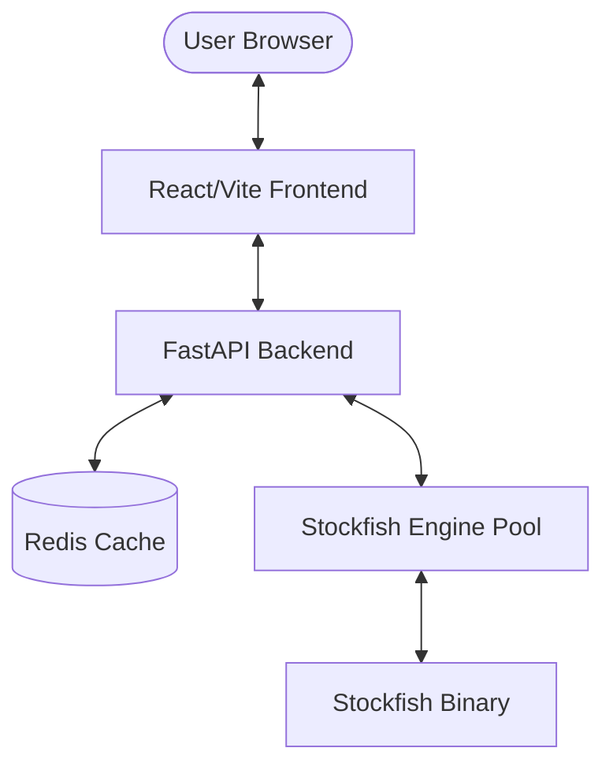

# ChessMind♟️

An **Open Source**, comprehensive full-stack chess analysis platform that provides real-time engine evaluations, PGN parsing, and a modern interactive user interface.

## 🚀 Quick Start (Recommended)

The easiest way to run the entire project is using **Docker Compose**.

### 1. Prerequisites
- Docker and Docker Compose installed. That's it! Works on **Windows, macOS, and Linux**.

> **No need to manually download Stockfish.** Docker containers always run Linux internally, so the build automatically downloads the correct Linux binary regardless of your host OS.

### 2. Run the Application
1. **Fork the Repository**: Click the **Fork** button at the top of the [GitHub Repository](https://github.com/Ashutosh-Shukla-036/Chess.git).
2. **Clone your Fork**:
```bash
# Replace <your-username> with your actual GitHub username
git clone https://github.com/Ashutosh-Shukla-036/Chess.git
cd Chess
```
3. **Start everything**:
   - **Using Docker Compose (All platforms)**:
     ```bash
     docker-compose up --build
     ```
   - **Using Build Script (Ubuntu/WSL)**:
     ```bash
     ./build.sh
     ```

- **Frontend**: [http://localhost:5173](http://localhost:5173)
- **Backend API**: [http://localhost:8000](http://localhost:8000)
- **API Docs**: [http://localhost:8000/docs](http://localhost:8000/docs)

---

## ✨ Key Features

- **Real-time Evaluation**: In-depth engine analysis using Stockfish 16+.
- **PGN Support**: Upload and analyze your games in standard PGN format.
- **Engine Pool Management**: Efficiently handles multiple analysis requests using a scalable engine pool.
- **Interactive UI**: Modern, responsive interface built with React, Framer Motion, and Tailwind CSS.
- **Performance Caching**: Redis-backed caching for frequently analyzed positions to ensure rapid response times.
- **Health Monitoring**: Built-in health checks for engine and cache status.

---

## 🏗️ Architecture



---

## 🛠️ Tech Stack

### Backend
- **Framework**: [FastAPI](https://fastapi.tiangolo.com/) (Python 3.11+)
- **Chess Logic**: [python-chess](https://python-chess.readthedocs.io/)
- **Real-time**: WebSockets
- **Caching**: Redis

### Frontend
- **Framework**: [React](https://reactjs.org/) with [Vite](https://vitejs.dev/)
- **Language**: TypeScript
- **Styling**: Tailwind CSS & Framer Motion
- **Components**: [react-chessboard](https://github.com/Clariity/react-chessboard), Lucide React
- **Charts**: Recharts

### Analysis Engine
- **Engine**: [Stockfish](https://stockfishchess.org/) (auto-downloaded during Docker build)

---

## 📁 Project Structure

```text
Chess/
├── backend/            # FastAPI Application
│   ├── app/            # Core API logic, schemas, and routes
│   ├── engine/         # Stockfish engine wrappers and setup
│   └── requirements.txt
├── frontend/           # React/Vite Application
│   ├── src/            # Components, hooks, and state logic
│   └── package.json
├── docker-compose.yml  # Container orchestration
└── build.sh            # Unix build script
```

---

## 🛠️ Development Setup

If you prefer to run services individually without Docker, please refer to the specific setup guides:

- 🐍 [Backend Setup Guide](file:///Chess/backend/README.md)
- ⚛️ [Frontend Setup Guide](file:///Chess/frontend/README.md)
- 🐟 [Stockfish Engine Setup](file:///Chess/backend/engine/STOCKFISH_SETUP.md)

---

## ⚙️ Configuration (Environment Variables)

The backend can be configured using environment variables. Create a `.env` file in the `backend` directory based on `.env.example`.

| Variable              | Description                                           | Default                    |
|-----------------------|-------------------------------------------------------|----------------------------|
| `ENGINE_POOL_SIZE`    | Number of Stockfish engine instances in the pool      | `2`                        |
| `REDIS_URL`           | URL for the Redis server                              | `redis://redis:6379`       |
| `STOCKFISH_PATH`      | Path to the Stockfish binary                          | `/app/engine/bin/stockfish`|
| `ENGINE_THREADS`      | Number of threads per Stockfish instance              | `1`                        |
| `LOG_LEVEL`           | Logging level (`DEBUG`, `INFO`, `WARNING`, `ERROR`)   | `INFO`                     |
| `REDIS_ANALYSIS_TTL`  | Time-to-live for cached analysis in Redis (seconds)   | `864000`                   |

---

## 🔍 Troubleshooting

- **Stockfish Binary Error**: The Docker build downloads the binary automatically. If running without Docker, download the binary manually for your platform from [stockfishchess.org](https://stockfishchess.org/download/), place it at `backend/engine/bin/stockfish` (Linux/macOS) or update `STOCKFISH_PATH` in your `.env` for Windows, and ensure it's executable (`chmod +x backend/engine/bin/stockfish` on Linux/macOS).
- **Redis Connection**: If running without Docker, ensure Redis is installed and running locally on port `6379`.
- **Port Conflict**: If port `5173` or `8000` is already in use, you can change them in `docker-compose.yml`.

---

## 🤝 Contributing

Contributions are welcome! Here's how you can help:

1. **Bug Reports**: Open an issue describing the bug and how to reproduce it.
2. **Feature Requests**: Open an issue to discuss new features or improvements.
3. **Pull Requests**: 
    - Fork the repo.
    - Create a new branch (`git checkout -b feature/awesome-feature`).
    - Commit your changes.
    - Push to the branch.
    - Open a Pull Request.

---

## 📄 License

This project is licensed under the terms of the MIT License. See [LICENSE](file:///Chess/LICENSE) for full details.